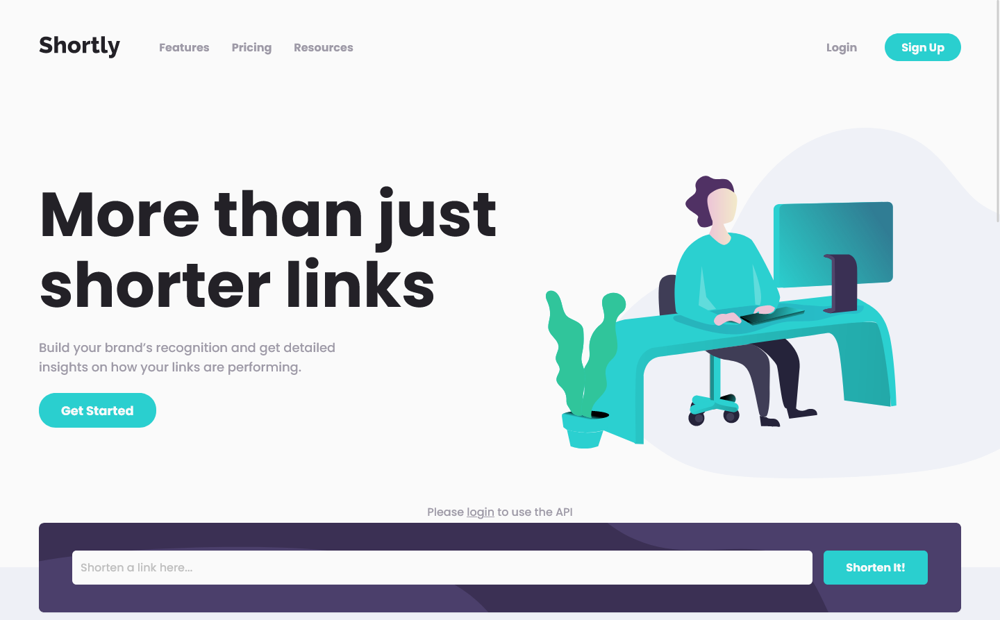
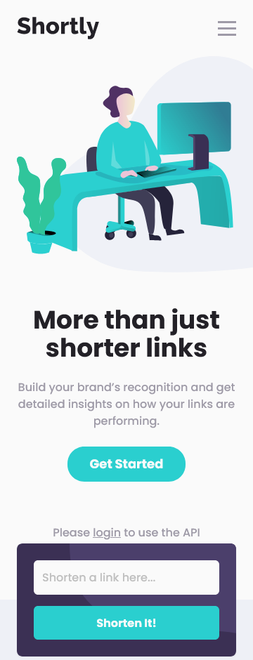

# Frontend Mentor - Shortly URL shortening API Challenge solution w/ SSR

This is a solution to the [Shortly URL shortening API Challenge challenge on Frontend Mentor](https://www.frontendmentor.io/challenges/url-shortening-api-landing-page-2ce3ob-G).

Take a look at the [Client-side version](https://github.com/AntoineC-dev/url-shortening-api) of this app if you don't care about SSR.

## Table of contents

- [Overview](#overview)
  - [The challenge](#the-challenge)
  - [Screenshot](#screenshot)
  - [Links](#links)
- [My process](#my-process)
  - [Built with](#built-with)
  - [What I learned](#what-i-learned)
  - [Continued development](#continued-development)
  - [Useful resources](#useful-resources)
- [Author](#author)
- [Acknowledgments](#acknowledgments)

## Overview

### The challenge

Users should be able to:

- View the optimal layout for the site depending on their device's screen size
- Shorten any valid URL
- See a list of their shortened links, even after refreshing the browser
- Copy the shortened link to their clipboard in a single click
- Receive an error message when the `form` is submitted if:
  - The `input` field is empty
  - **BONUS** show shrtcode api errors
- **BONUS** Authentication w/ Supabase & Github OAuth
- **BONUS** Storage w/ Supabase Postgres Database
- **BONUS** SSR Auth for better UX

### Screenshot





### Links

- Solution URL: [Go to solution](https://www.frontendmentor.io/solutions/url-shortening-api-sveltekit-ts-tailwind-supabase-ssr-auth-mRYfojxTTh)
- Live Site URL: [Go to live site](https://url-shortening-api-ssr.vercel.app/)

## My process

### Built with

- Semantic HTML5 markup
- Flexbox
- CSS Grid
- Mobile-first workflow
- [SvelteKit](https://kit.svelte.dev/) - JS framework w/ SSR (Server-Side Rendering)
- [TailwindCss](https://tailwindcss.com/) - Utility-first CSS framework
- [Typescript](https://www.typescriptlang.org/) - Strongly typed JS
- [Supabase](https://supabase.com/) - Open source Firebase alternative
- [Clipboard API](https://developer.mozilla.org/en-US/docs/Web/API/Clipboard_API) - Easy and secure way to update the clipboard's contents

### What I learned

#### Work with svgs in sveltekit

I was searching for a way to import svgs but keeping the ability to style them with tailwind classes.

I found the [SvelteKit SVG Plugin](https://github.com/poppa/sveltekit-svg) which extends the [SVGO Plugin](https://github.com/svg/svgo) and gives you the ability to remove default styles like **fill** **stroke** or **fixed width & height** & import Svgs in your .svelte files just like other components.

```ts
//  ---- vite.config.js ---- //
import { sveltekit } from "@sveltejs/kit/vite";
import svelteKitSVG from "@poppanator/sveltekit-svg";

/** @type {import('vite').UserConfig} */
const config = {
  plugins: [
    sveltekit(),
    svelteKitSVG({
      includePaths: ["./src/lib/assets/icons/"],
      svgoOptions: {
        plugins: [
          {
            name: "preset-default",
            params: { overrides: { removeViewBox: false } },
          },
          // I used the includePaths option to remove fill & stroke only for the svgs in the icons folder
          { name: "removeAttrs", params: { attrs: "(fill|stroke)" } },
          "removeDimensions",
        ],
      },
    }),
    svelteKitSVG({
      includePaths: ["./src/lib/assets/images/"],
      svgoOptions: {
        plugins: [
          {
            name: "preset-default",
            params: { overrides: { removeViewBox: false } },
          },
          "removeDimensions",
        ],
      },
    }),
  ],
};
export default config;

// ---- .svelte file ---- //
<script lang="ts">
  import HeroSVG from "$lib/assets/images/hero.svg";
</script>

<div class="w-[min(100%,48rem)] md:order-1 md:basis-[45%]">
  <HeroSVG class="w-[min(150%,48rem)]" />
</div>

// ---- src/app.d.ts (typescript only) ---- //
declare module "$lib/assets/*.svg" {
  import type { SvelteComponentDev } from "svelte";
  const content: SvelteComponentDev;
  export default content;
}
```

#### Supabase auth & Database w/ SSR

Take a look a my [Client-side version](https://github.com/AntoineC-dev/url-shortening-api) of this app to see why I decided to implement SSR.

In this SSR version, Auth is based on session cookies. We use the SvelteKit handle hook to check if the user is authenticated & has the authorization to access the data on app initialization & on each request after that.

```ts
// ---- src/hooks.ts ---- //
export const handle: Handle = async ({ event, resolve }) => {
  const cookie = event.request.headers.get("cookie");
  event.locals.apiRepo = apiRepo;
  event.locals.linksRepo = linksRepo;
  event.locals.userRepo = userRepo;
  const session = getCookieValue(cookie, "session");
  const refreshSession = getCookieValue(cookie, "refreshSession");

  let sessionCookie: string | undefined;
  let refreshCookie: string | undefined;
  if (session) {
    event.locals.user = await userRepo.findByAccessToken(session);
  } else {
    if (!refreshSession) {
      event.locals.user = null;
    } else {
      try {
        const result = await userRepo.refreshSession(refreshSession);
        event.locals.user = result.user;
        sessionCookie = result.sessionCookie;
        refreshCookie = result.refreshCookie;
      } catch (error) {
        event.locals.user = null;
      }
    }
  }

  const response = await resolve(event);
  if (sessionCookie && refreshCookie) {
    response.headers.set("Set-Cookie", `${sessionCookie}, ${refreshCookie}`);
  }
  return response;
};
```

Then we populate the stores with the fetched data in the +layout.server file:

```ts
export const load: LayoutServerLoad = async ({ locals }) => {
  const links = await locals.linksRepo.getAll();
  return { user: locals.user, links };
};
```

#### Shrtcode API

Awesome API with clear error messages that I could just forward to the user. [Check it out](https://shrtco.de/)

### Continued development

I still want to improve the UX by adding a loading state when calling the github's OAuth service; but i could not find a way to do it because of the redirection. In practice, the app restarts after during the login() and supabase populates the url with the session data I use to create the session cookies. But it means that all the components including the layout mount again on redirect and reset all stored states.

The best experience would be to make all the OAuth logic directly on the server without any redirection. If you know a way please share. It would be great!

### Useful resources

- [SVGOMG](https://jakearchibald.github.io/svgomg/) - Remove all the annoying default styles on Svgs.
- [Clipboard API](https://developer.mozilla.org/en-US/docs/Web/API/Clipboard_API) - Easy and secure way to update the clipboard's contents.
- [Supabase Docs](https://supabase.com/docs) - Awesome open source tool with good documentation.
- [Shrtcode Docs](https://shrtco.de/docs) - Awesome API with straightforward documentation and easy error handling.

## Author

- Frontend Mentor - [@AntoineC-dev](https://www.frontendmentor.io/profile/AntoineC-dev)

## Acknowledgments

I would have turned crazy without the help of Johnny for the SSR auth. Check his techy cat repo and his Youtube Channel SvelteKit & NextJs tips

- [Johnny Magrippis Youtube Channel](https://www.youtube.com/channel/UCm1ALyg61uhPoTnZBm7mY2g) - Lots of content on SvelteKit and SSR.
- [Techy-cat Repo](https://github.com/jmagrippis/techy-cat) - Johnny's implementation of SSR auth with supabase magic links.
